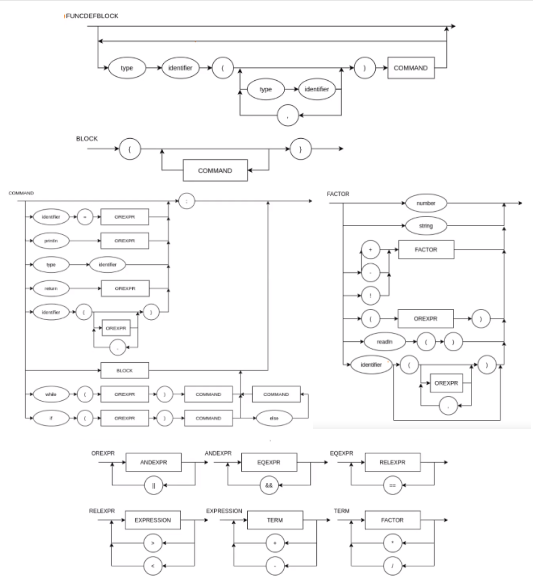

# CompiladorLogica2021
Compilador para a matéria Lógica da Computação 

Para rodar o programa seguir o exemplo: python3 calculadora.py testfile.c

EBNF:

BLOCK = { COMMAND } ;  
COMMAND = ( λ | ASSIGNMENT | PRINT), ";" ;  
ASSIGNMENT = IDENTIFIER, "=", EXPRESSION ;   
PRINT = "println", "(", EXPRESSION, ")" ;   
EXPRESSION = TERM, { ("+" | "-"), TERM } ;   
TERM = FACTOR, { ("*" | "/"), FACTOR } ;   
FACTOR = (("+" | "-"), FACTOR) | NUMBER | "(", EXPRESSION, ")" | IDENTIFIER ;  
IDENTIFIER = LETTER, { LETTER | DIGIT | "_" } ;   
NUMBER = DIGIT, { DIGIT } ;   
LETTER = ( a | ... | z | A | ... | Z ) ;   
DIGIT = ( 1 | 2 | 3 | 4 | 5 | 6 | 7 | 8 | 9 | 0 ) ;  
